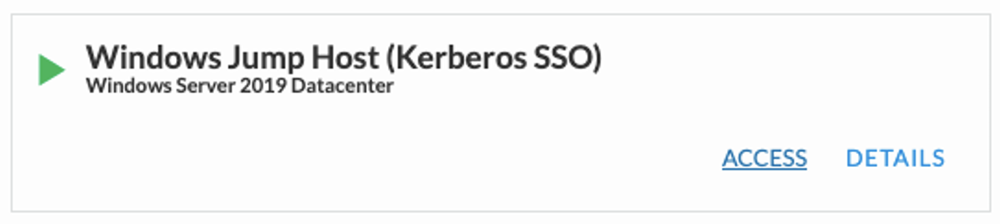
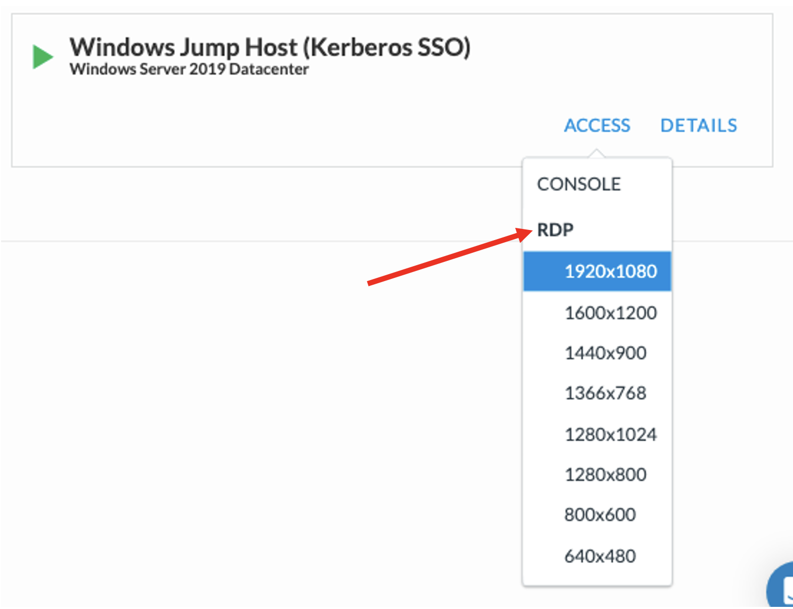
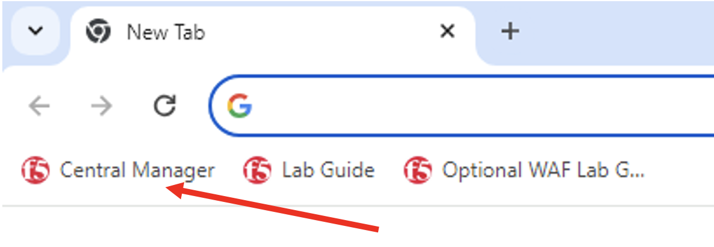
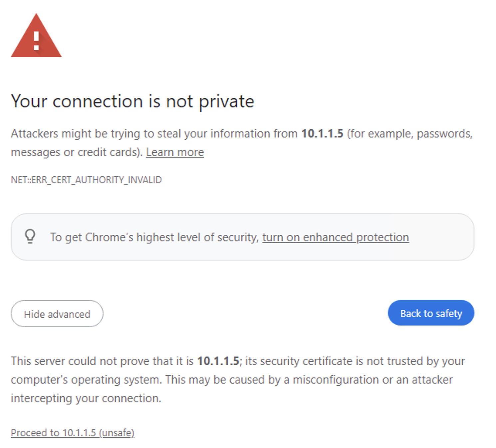
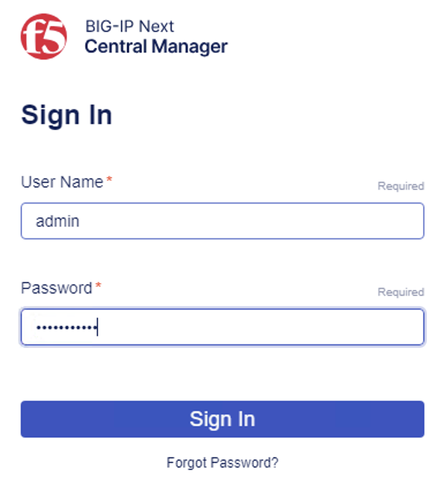

Welcome to F5 Academy – Next Access lab. 
========================

This lab consists of 3 use cases:

1. Azure Authentication with Kerberos
2. SAML Federation with Okta and HTTP Connector through API
3. VPN with Machine Tunnel and BIG-IP Edge Client

The first lab you will deploy an Access policy using Next Central Manager interface. The second lab you will use the Postman in the Windows jump host to deploy an HTTP Connector policy via API calls. Lastly, you will use Central Manager again to deploy an Access VPN policy. 

To learn about other Next Access use cases please visit: https://clouddocs.f5.com/training/community/Next-Access/html/class1/class1.html

**Lab Overview:**

In the lab are the following devices:

bigip-next-03 
bigip-next-04 

**BIG-IP Next Central Manager**

Windows Client Testing 
Windows Jump Host

You will predominantly work from the Windows jump host for all the labs. 

You will need to log into the Windows-Client-Testing to test the VPN Access Policy in Lab 3.

**Credentials for the Next environment:**
**username:** admin 
**password:** Welcome123!

**Credentials for Windows Jump Host:**
**username:** f5access/user 
**password:** user

**Credentials for Windows Client Testing:**
**username:** user 
**password:** user

Accessing the Lab environment

1. On the UDF Deployment page, click on Access from the Window Jump Host. 

2. Select and click on one of the desire resolution size. This will download an RDP (Remote Desktop Profile) file. 
.. note:: Some browser there may not be an option for a resolution size, please select RDP from the available list.

3. Open the RDP session and use the following username/password

**Username:** f5access\user
**Password:** user

4. In the Windows Jump Host, open Chrome browser, and click on the Central Manager shortcut to log into Next Central Manager. 

5. You may get a Certificate Warning, this is because we’re using a self-signed certificate. You can safely click Advanced and Proceed to 10.1.1.5. 

6. Log into Central Manager using the following credential.

**Username:** admin
**Password:** Welcome123!

 
Let’s continue to Lab 1!!!

.. toctree::
   :maxdepth: 1
   :glob:

   module*/module*
