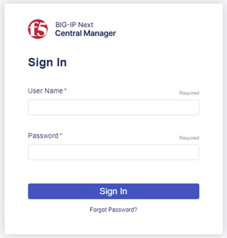
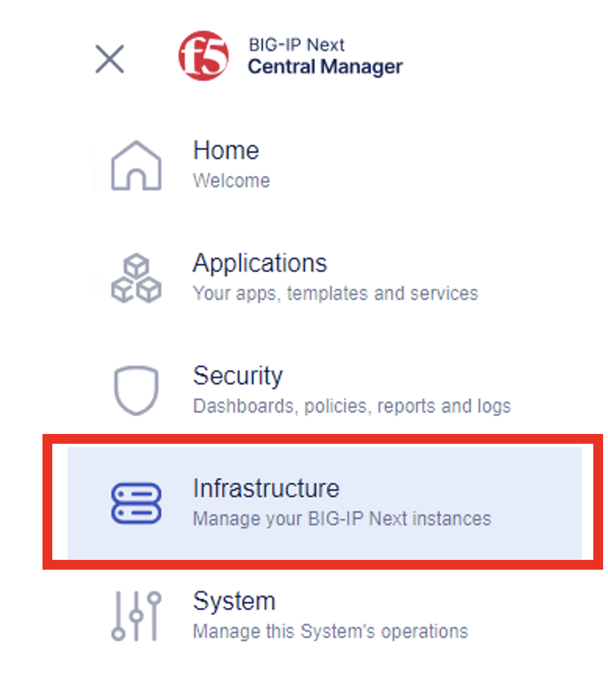
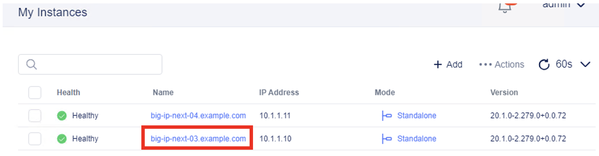
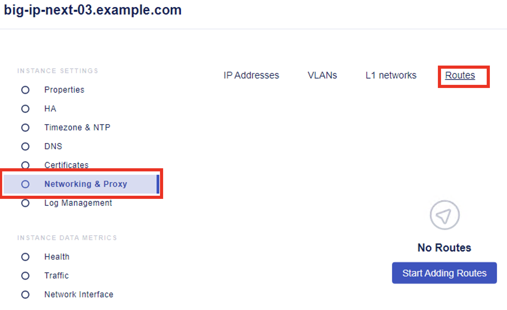
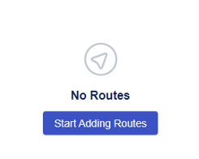
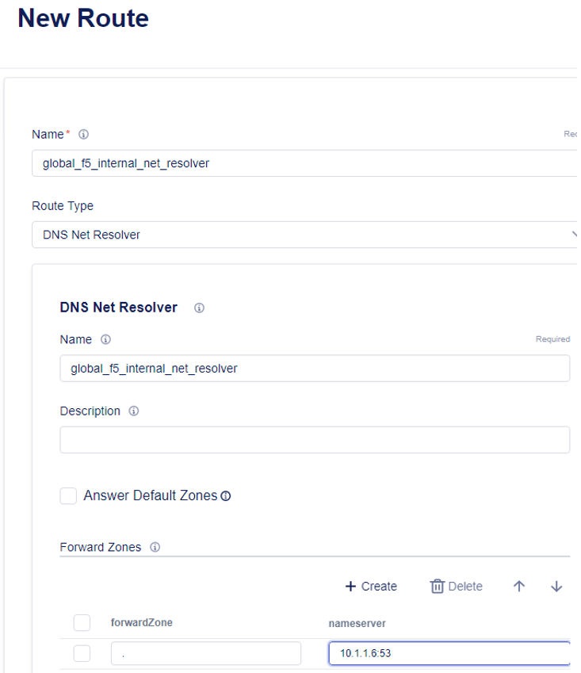
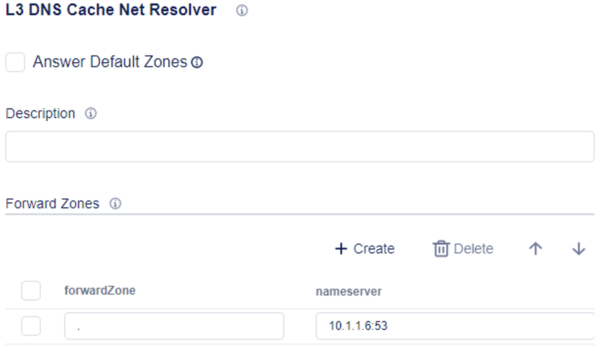
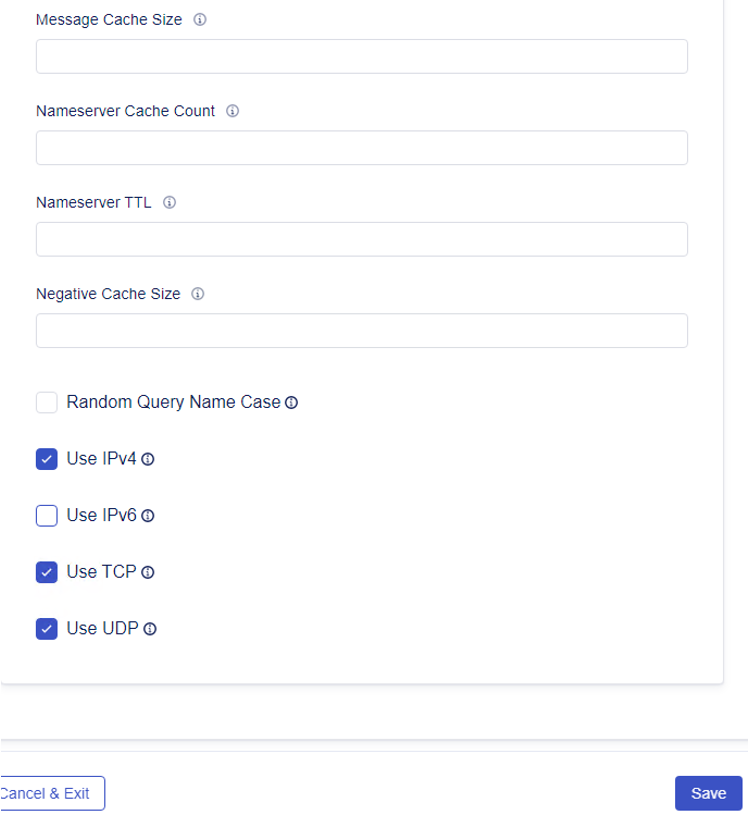

Lab 1.1: Create DNS Resolver
=============================

Configuring a L3 DNS Resolver
-----------------------------

1. Access **BIG-IP Next Central Manager** if you're not already logged in.

2. Click on the Workspace icon and select Infrastructure

3. In the My Instances dashboard, click on *big-ip-next-03.example.com* instance.

4. This will open the Instance Settings screen. On the left side, click on **Networking & Proxy**. Click on **Routes** tab from the menu across the top. 

5. Click on **Start Adding Routes**

6. We will bring up the **DNS Net Resolver** configuration menu where we will define a name and the nameserver for the resolution.

- **Name:** global_f5_internal_net_resolver 
- **Route Type:** DNS Net Resolver
- **DNS Net Resolver:** global_f5_internal_net_resolver
 

7. In the same screen, scroll down to **Forward Zone**, and click **Create**. Enter the following parameters.

- **Forward zone:** .  This is a period or single dot
- **Nameserver:** 10.1.1.6:53

8. Scroll down to see the additional settings, and set the following parameters.

**Name:** global_f5_internal_net_resolver
**Select:** Use IPv4, Use TCP, Use UDP

9. Click **Save**, and then click **Cancel & Exit** to exit out of the Instance Setting screen.

This ends this section of the lab, onto the next. 
