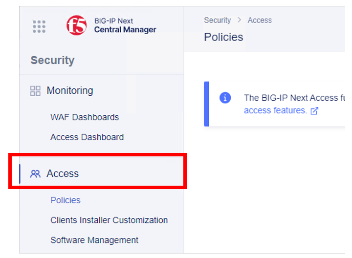
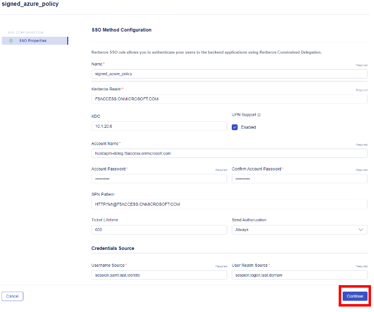

Lab 1.2: Create an Access Security Policy
===========================================

Creating a security policy with authentication to Azure and Kerberos Single Sign-On
-----------------------------------------------------------------------------------

1. Access **BIG-IP Next Central Manager** if you're not already logged in.

.. image:: images/lab2-cmlogin.png
    :width: 400 px

2. Click on the Workspace icon and select Security

Click on the **Access** from the Security menu.

3. Click the **Start Creating** button to create a new Access policy 

4. This will open the Create Policy menu to start the policy creation process. In **Choose policy type** select **Per-Session Policy**. In **How would you like to create it?** select **Start from scratch**
| Click on **Next** button at the top right-hand side to continue configuring the policy. 

5. In the **Create Per-Session Policy** screen, let's start configuring the policy.

In the **General Properties** screen set the following parameter(s), for the rest of the settings you may leave it as default.

- **Policy Name:** signed_azure_policy
- Click **Continue** 

.. note:: As you continue the rest of the policy creation process, see the screen shot in each section for a visual example of the configuration.

6. In **Session Properties**, keep the default settings, click **Continue**

7. In the **Logging** screen, you may want to adjust the logging to debug for troubleshooting proposes. For this lab we will keep all the default settings.

.. image:: images/lab2-logging.png
    :width: 400 px

8. In the **Single Sign-On** screen, is where you can configure Single Sign-On to your applications. In this lab we will setup Single Sign-On for Kerberos.

Click on the drop-down arrow on the **Start Creating** button and select **Kerberos**.

9. This will open the SSO Method Configuration screen. In this screen set the parameters as follow.

- **Name:** remove the trailing number and replace with **signed_azure_policy**. See image below as reference.
- **Kerberos Realm:** F5ACCESS.ONMICROSOFT.COM  
- **KDC:** 10.1.20.6
- **Account Name:** host/apm-deleg.f5access.onmicrosoft.com
- **Account Password:** F5twister$ 
- **SPN Pattern:** HTTP/%h@F5ACCESS.ONMICROSOFT.COM
- **Username Source:** session.saml.last.identity
- **User Realm Source:** session.logon.last.domain

10. Click **Continue**, this will take you back to the Policy Configurations screen. Click **Continue** on the next screen.

11. **Endpoint Security** screen, you can setup Endpoint Security such as ensuring the firewall is enabled on a client workstation before access is granted. In this lab, we will not use this feature. Click Continue. 

12. **Resources screen**, you can set additional capabilities and features such as Network Access, and Webtops in this screen. In this lab we will not use these capabilities. Click Continue.

13. **Policy Endings**, you can define addition policy ending logic as needed for your use case here. In this lab we will accept the default. Click Finish.

14. After clicking on **Finish** it should bring you back to the **Create Policy** screen. Now, we will use the Visual Policy Designer (VPD) to continue building the policy.

15. Under Flows, drag and drop **Generic SAML Federation** flow to the VPD. You will need click on the little dots to the right of the flow type to grab the flow and drop into the VPD. 

:bulb: **Tip:** When dropping the flow type onto the VPD, you want to make sure the flow type box is over the plus sign and the plus sign turns blue.

The result should look like the following screen shot.

16. Click inside the Flow type box. This show 3 buttons; **Delete**, **Edit**, and **Collapse** buttons. Click on the **Collapse** button to start adding Rules to the Flow.

Clicking on the **Collapse** button will expand the Flow type box.

17. Click inside the SAML-Federation Rule box, and select the **Edit** button

This will open the **SAML Federation Rule** properties screen. Please follow the screenshots below for each section.

18. In the **SAML Rule Properties** configuration, replace the trailing number in the Name field to **azure_signed_policy**. Leave the **Provider Configuration** as **Basic**. Click **Continue**.

19. In the **Providers** screen, you can set the different Service and Identity Providers in this screen. In this lab we will setup both a Service Provider and Identity Provider.

20. Click on **Start Creating** under Service Provider. In the **Add Service Provider** screen input the following information, and then click **Save**.

- **EntityID:** https://mbip-1.f5access.onmicrosoft.com 
- **Host:** https://mbip-1.f5access.onmicrosoft.com 
- **Security Properties:** check the box for **Want Signed Assertion**

21. Click on **Start Creating** under Identity Provider. In the **Add Identity Provider** screen input the following information, and then click **Save**.

- **Name:** remove the trailing number, and replace with **azure_signed_policy**
- **EntityID:** https://sts.windows.net/8807dced-9637-4205-a520-423077750c60/  
- **SSO URL:** https://login.microsoftonline.com/8807dced-9637-4205-a520-423077750c60/saml2  
- **Identity Provider’s Assertion Verification Certificate:** click the drop down arrow, and select the *azure_signed_cert*

22. After you click **Save** this should take you back to the Rule Configuration Screen, click **Continue**.

23. In the **Branches** screen, keep the default. Click **Finish**.

24. Close the SAML Rule by clicking on the **Collapse** button.

.. image:: images/lab2-samlclose.png
    :width: 400 px

25. In the SAML Flow Allow branch, set the policy to **Allow**.

26. **Save** the policy and close the VPD by clicking on **Cancel**.

You have completed creating an security policy!
