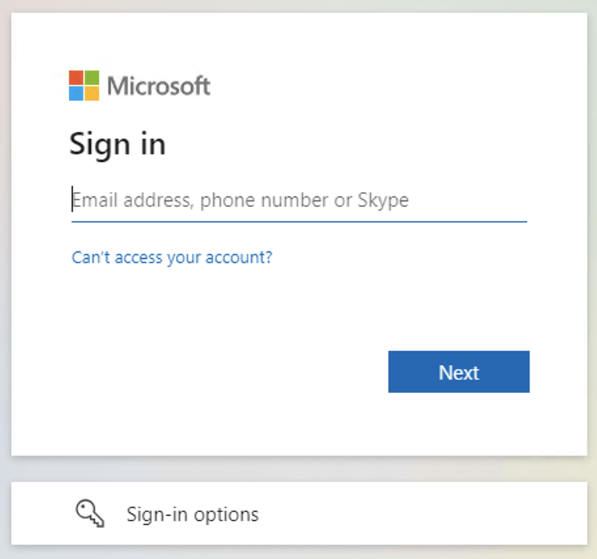
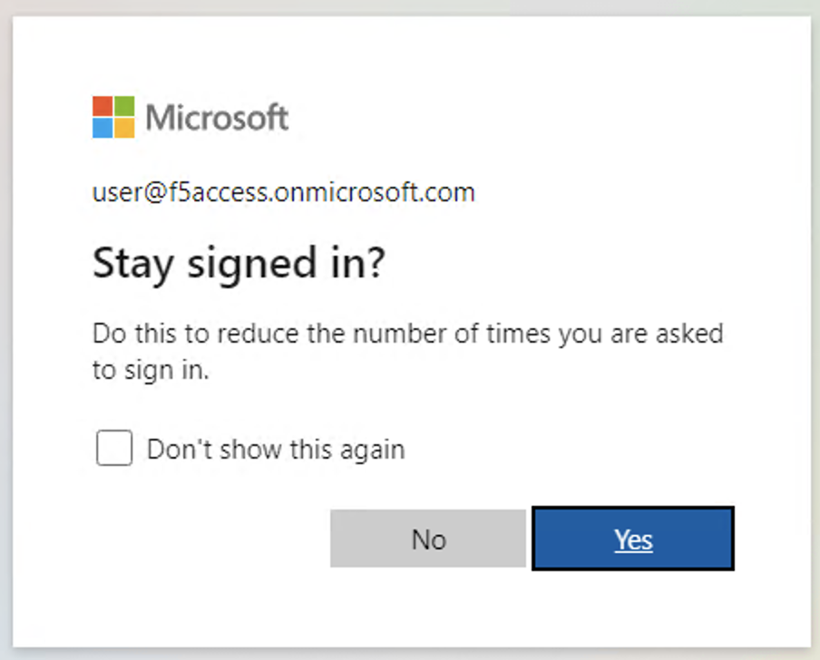
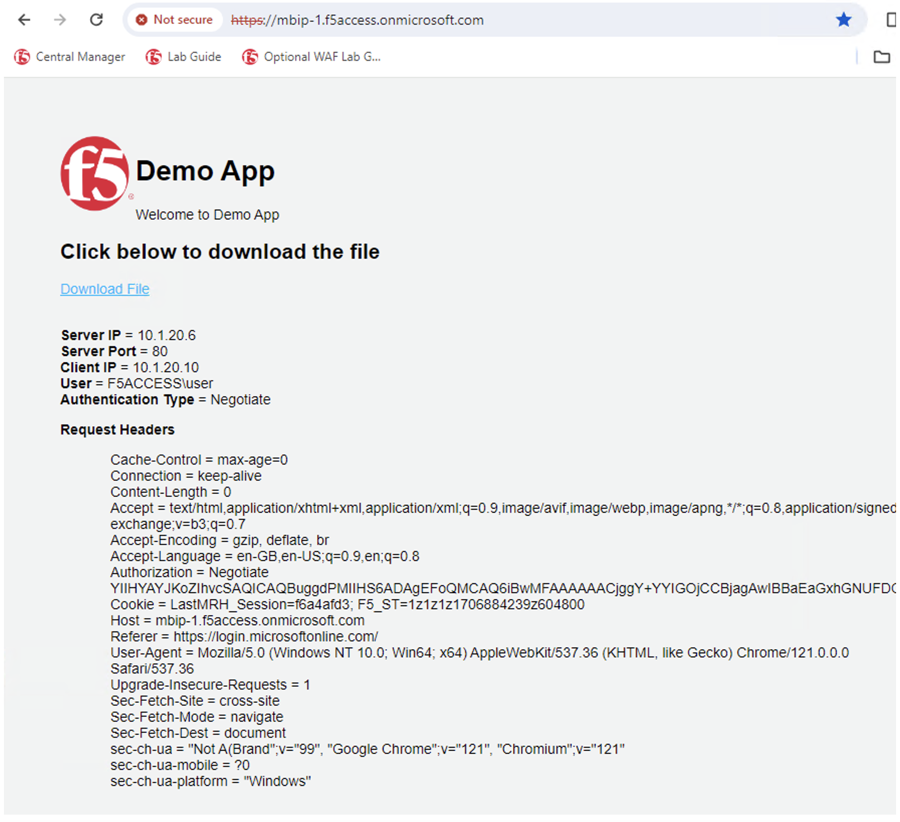

Lab 1.4: Test Application
=================================

Test Connectivity to the Application
------------------------------------
1. Open a new Chrome browser or tab and type: https://mbip-1.f5access.onmicrosoft.com 

You may get a security warning **Your Connection is Not Private**, this is because we're using a self-signed certificate. It is safe to proceed. 

2. Log in with the following username/password: 
- **username:** user@f5access.onmicrosoft.com
- **password:** user

You may get a screen, asking if you want to stay signed in. Click **No**

You should see the F5 Demo App after a successful login.

This concludes Lab 2 - Azure authentication with Kerberos Single Sign On.