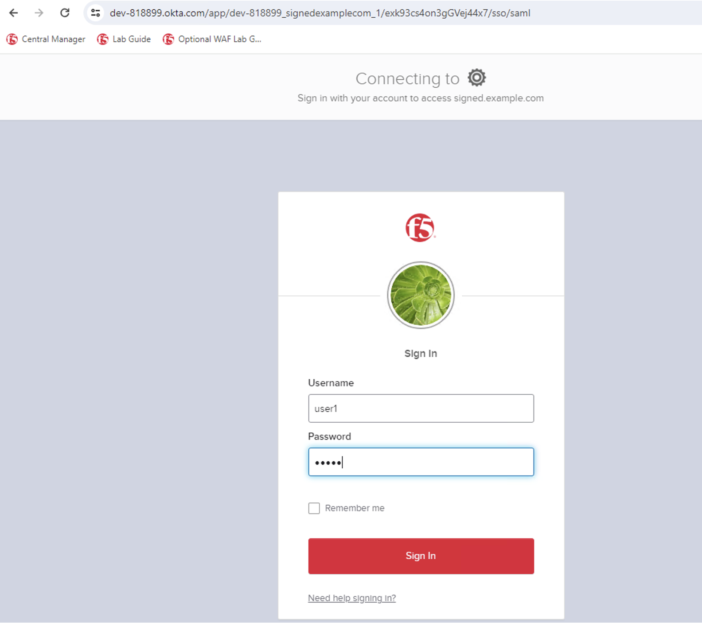

Lab 2: SAML Federation with Okta and HTTP Connector
====================================================

Use API requests to create an Access policy with Okta Federation and a HTTP Connector profile. Deploy this policy to an application.
-------------------------------------------------------------------------------------------------------------------------------------

1. On the jump host, open Postman from the desktop shortcut

2. Expand the **BIG-IP Next Access Demo** collection, and click on **SAML-Okta-Signed with HTTP Connector** folder

3. In the **SAML-Okta-Signed with HTTP Connector** folder click on **Login** request. 

4. This will open the **Login** request, click on **Send**. This will generate an access token to login to Central Manager.

Please validate you received a response code 200 Ok before proceeding to the next step.

   
5. Click on **Upload Certificate to CM** request. 

6. In the **Upload Certificate to CM** request click **Send**. This will import the certificate needed for Okta federation.

Please validate you received a response code 200 Ok before proceeding to the next step.

.. note:: You may get a response code of 202 instead of 200. This means the request is successful, however it's still processing the data or body of the request. In this case, please wait for a few seconds before proceeding.

7. Click on **Create Policy + HTTP Connect** request 

8. In the **Create Policy + HTTP Connector** request click **Send**. Again, verify you received a response 200 OK code.

9. Please do follow the same step as above for the **Create Application through CM** and **Deploy Application to Instance** requests. 

What these requests are doing is building the application and its properties, and then deploying the application to the BIG-IP instances. 

As you click **Send** on each request, ensure you are getting an response code 200 OK. If not, please let the instructor or lab assistance know.

10. Log back into **Central Manager**, and click on the **Workspace** icon, and go to the **Security** workspace.

11. In the **Security** workspace, click on **Policies** under **Access** section. Verify **access_okta_Connector_policy**  is created. This policy was created by the Create Policy + HTTP Connector request from Postman. The API request configured an Generic SAML flow with a HTTP Connector rule that is configured to do a risk assessment with the demo application. 

Click on the **access_okta_Connector_polic**  link to open the VPD.

12. Observe a **Generic-SAML-Federation** flow was added to the **Visual Policy Designer**. 

13. Click on the **Expand** button to expand the flow. 

.. image:: images/lab-postman10.png
    :width: 400 px

14. Inside the **Flow** you will see a **SAML Federation** rule, **HTTP Connector Rule**, and **Message Box**. 

15. Click the **Edit** button for **SAML Federation** flow to observe the **Service Providers** and **Identity Providers** configurations.

16. Once you’re done, click **Cancel**.

17. Click **Edit** on **HTTP-Connector** rule. This configuration is the settings Access will use to connect to the external server. In this lab, Access will send API authentication requests to a risk assessment server. When API requests are considered risky by the server (i.e. too many requests) the server will send back a variable to Access to deny access to the resource. Once you’re done reviewing, click **Cancel**.

18. Like in BIG-IP Classic Access Policy Manager (APM) you can add a custom Message Box. To review the configuration on how to set this up click on the Edit button for the Message Box rule. Once you’re done reviewing, please remember to click on Cancel.

19. Click on **Exit** at the top right-hand corner to exit out of the policy.

20. Let’s verify the Application. Click on the **Workspace** icon and go to **Application** workspace.

21. In **My Application Services**, observe there’s a new application **access_okta_connector_app** was created.

22. Click on the application, and in the next screen click on **Edit** at the top right hand corner.

23. Review the virtual server configurations for this application. You’ll notice the virtual server name, pool name, the listening port, an access policy is attached to the virtual server. To see further details like what policy is attached to the virtual server click on the **Edit** button. 

24. Once you are done reviewing, please click on **Cancel** and **Exit**. And then **Exit** again to close the **Application** menu.

25. Let’s verify this deployment is working as expected. On another browser tab type in the url **https://signed.example.com**. 

You may get a certificate warning. This is expected because we are using a self-signed certificate. Click on **Advanced** and click on the link to **Proceed**.

26. You will be prompted for login. Enter the following credential: **username: user1 password user1**

27. A successful login will result in the Demo App page displaying for you. 

28. To simulate a denial based on an increased risk behavior, click on the refresh button a few times, and open a new incognito browser, and go back to the URL https://signed.example.com and log in with the same username and password as previously which is **username: user1 password: user1**

29. This time you should get the warning message. Click on **Click here to close**.

.. note:: It’s important to this increased risk determination is driven by the external HTTP server and not Access. HTTP Connector is passing the request or in this case number of requests to the external HTTPS server. The external HTTP server makes the determination that the requests from this client are potentially risky so passes this information onto Access which then it’ll deny the user access. 

30. The next screen will give you a session reference number, and that your access has been denied by Next Access. 

This concludes lab 2!

