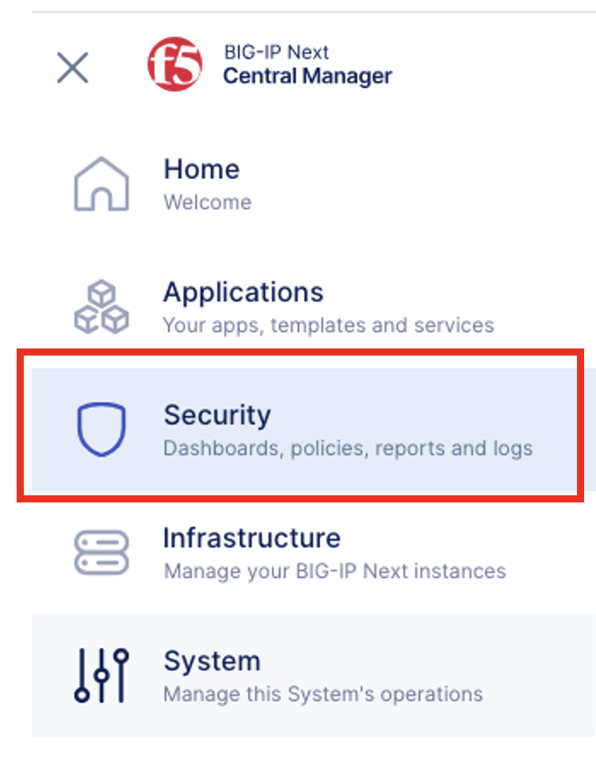
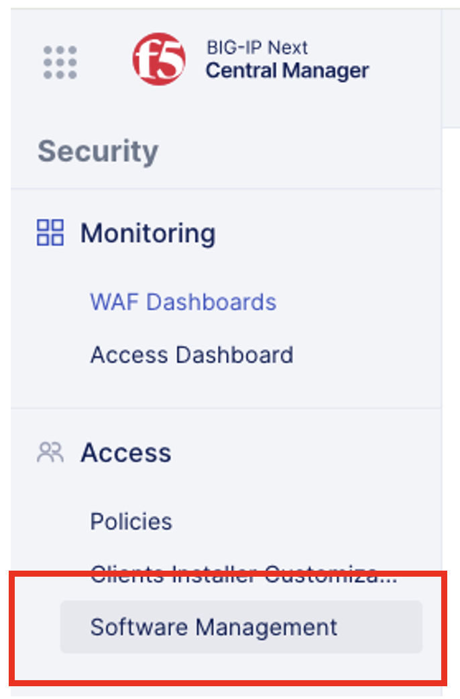
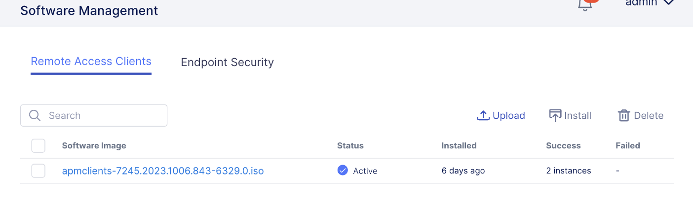
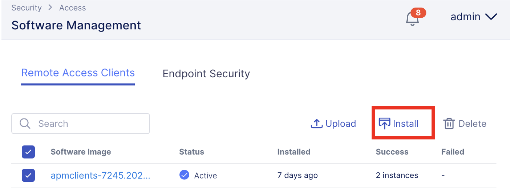
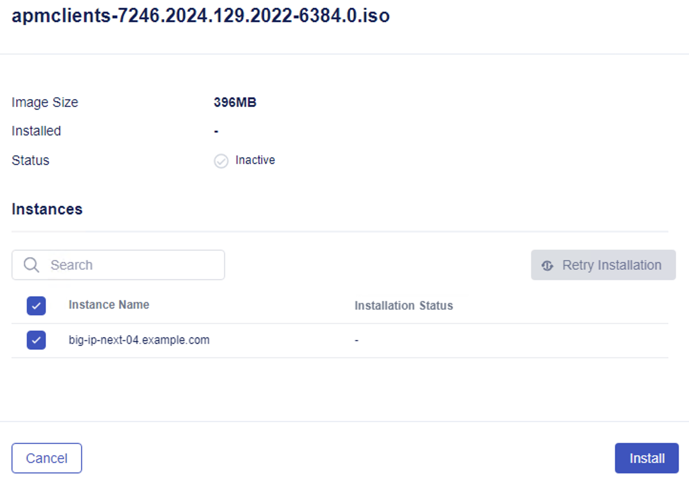
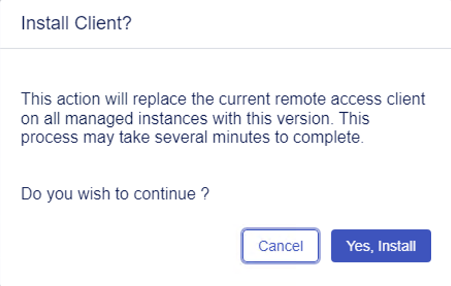
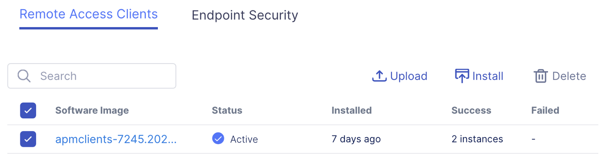

Lab 3.1 - Installing APM Client and Endpoint Security Package
===============

This is an observation lab to demonstrate the steps required to get APM Client and Endpoint Security Package installed.
-----------------------------------------------------------------------------------------------------------------------

1. Log into the Central Manager console if you’re not already logged in.

2. Click on the **Workspace** menu the dotted grid at the top left hand corner, and select the **Security** workspace from the slide out menu.

3. Click on **Software Management** under the **Access** section. 

In this lab, we have pre-installed the APM Remote Access Client and Endpoint Security to speed up the lab process. In your environment you may need to download the latest ISO from https://my.f5.com, and upload it to Central Manager. Once the ISO files has been uploaded you can follow the next steps to install the packages on the BIG-IP Next instances.

4. On the Remote Access Clients tab, the APM Client should be listed, and in an Active status, and installed on 2 instances. 

Follow along the next few steps on how to install ISO files. 
 
5. To install APM client, after uploading the ISO to Central Manager, it’ll appear in the list of available clients to install.

6. Check the box next to the name of the APM client ISO file, and click on **Install** button at the top right hand corner.

7. This will open the menu to select which BIG-IP Next instance to install the APM Client. Click the check box next to the BIG-IP Next instance you would like to install the APM client. 

In this lab, we have installed the APM client, which is why the screen shot looks a little different. 

8. After clicking on **Install**, the next window, will ask if you would like to install the client. Click **Yes, Install**.

9. This process take a couple of minutes to complete. You should see the status Installing.

.. image:: images/lab-cm7.png
   :width: 400 px

10. You should still be on the instance page. Click on **Cancel** button at the bottom left to go back to the Software Management.

.. image:: images/lab-cm8.png
   :width: 400 px

11. You will follow similar steps as above to install the Endpoint Security ISO.  

12. For this lab, let’s verify both Remote Access and Endpoint Security has been installed on the BIG-IP instances.

You should be back at the Software Management screen, and on the Remote Access Client tab.

Verify the APM client is installed on 2 instances and Status is Active.

13. Click on **Endpoint Security** tab. Verify the Endpoint Security package is installed on 2 instances and **Status** is **Active**.

.. image:: images/lab-cm10.png
   :width: 400 px

This completes this lab. Let’s go create the VPN Access policy.
