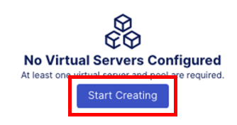
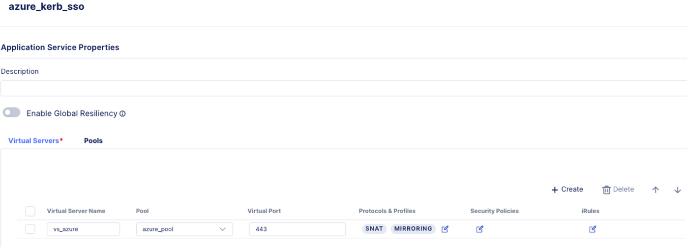

Lab 3.3: Deploying an Application for VPN service.
===================================================

1. In Central Manager click on the **Workspace** icon at the top left corner, select **Applications**.

2. Click **Add Application**.

3. In the **Add Application** menu, type in the application name as **vpn_app**, and the click **Start Creating** button. Leave **Application Service** as **Standard**.

4. In the Virtual Servers menu, click on **Start Creating** button to create a virtual server. 

5. In the **Virtual Servers** tab, enter the following settings

**Virtual Server Name:** vpn_vs
**Virtual Port:** 443 

6. Click on the **Edit** button under **Protocols & Profiles**

7. In the **Protocols & Profiles** menu, tick the slider button next to **Enable HTTPS (Client-Side TLS)** so it’s enabled. 

8. Under **Please choose a trust CA certificate**, click the drop-down arrow and select **DDC_CA cert**.

9. Under **Client Side TLS**, click the **Add** button. 

10. In the **Add Client Side TLS** menu, set the name to **client_cert**. Under RSA Certificate click on the drop down menu and select **self_demo.f5.com**. Click **Save**.

11. Under the **Security Policies** column, click on the **Edit** button

12. In the **Security Policies** menu, slide the slider button next to **Use an Access Policy** to the right to enable it. Under Access Policy, click on the drop-down box and select the **vpn_policy** created in the previous lab. Click **Save**. 

13. Back in the Application Services Properties, click on **Review and Deploy** button.

14. In the **Deploy-to** menu, click on **Start Adding** button to add the BIG-IP Next instance the VPN application will be deployed on. Select **big-ip-next 03** from the list, and click **Add to List**.

15. In the Instance enter the following IP address in the Virtual Address field: **10.1.10.160**. 

16. Click on **Configure** button, this will open the configuration for the BIG-IP Next instance.

17. In the instance, click on the **vpn_policy** link under Per Session Policy column

18. Clicking on the vpn_policy will open up the DHCP pool you previously defined in the policy. This is where you would define the DHCP address scope. Click on **ip_pool**. We want the range to be between 10.1.20.100 and .110 so under **Start Address** enter **10.1.20.100** and under **End Address** enter **10.1.20.110**. Click **Finish**, and then click **Finish** again on the next screen to close of the ip_pool screen.

19. In the Deploy To screen review the configuration to make sure it matches the screen shot below, and then click **Deploy Changes**.

20. In the Deploy Application Service window, click **Yes, Deploy**.

21. As the application is being deployed to the BIG-IP Next instance you will see this pop up window

22. Once the application is deployed, the Application Dashboard will be displayed. Observe, the application health is Good and Green.

You are now completed with portion of the lab. Let's test the policy.