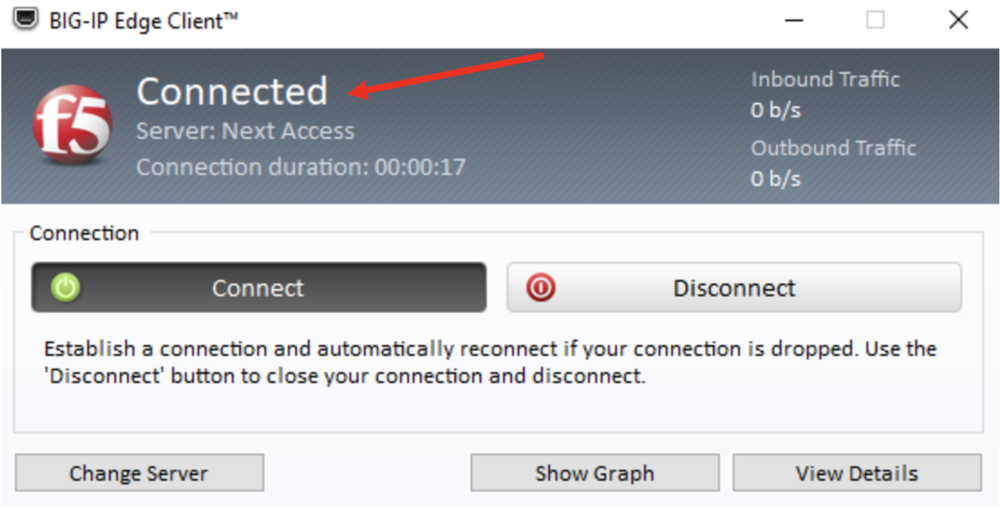

Lab 3.4: Testing and Validating Access Policy
=============================================

In this lab we will validate the VPN policy we created works for both machine tunnel and the BIG-IP Edge client. 

This lab already has the machine tunnel and BIG-IP Edge client installed. In a production environment you may need to create the machine tunnel client and install it on the workstation. 

1. From the UDF course page. Click on the Access method for the Windows 10 box, select Console. 

.. note:: It’s important to use the console access method. Once machine tunnel is enabled, RDP may not work appropriately. This is due to the UDF lab environment. 

2. Log into the Windows 10 box with the following username and password: user/user. 

3. First we will test the machine tunnel use case. Recall machine tunnel is an interactive VPN session. It runs as a service at startup. To validate this use case we will need to reboot  the Windows 10 machine. Before doing so let’s check to make sure the IP address is on the external IP address of 10.1.10.x/24 network. (Note to self, describe lab environment above in lab)

You can do so by opening a command window, and type ipconfig at the prompt. Observe the IP address. 

Restart the Windows 10 box by clicking on the Windows Icon, and selecting Restart from the menu.

4. After the Windows 10 box reboot, log into the Windows 10 box, and check the ip address. The new ip address should be 10.1.20.11x, which is one of the IP addresses define in the DHCP pool. 

5. Let’s verify you can access an internal application. Open a browser and go to http://10.1.20.6  

.. note:: You may get a certificate warning, you can safely ignore this message, and continue. 

6. If you can open the demo application, then you have successfully connected to the internal resource.

7. Now, let’s verify the session information in Central Manager. Go to BIG-IP Next Central Manager, and open the Security Workspace, and click on Access Dashboard.

8. Observed the Active Session. This have information about the session, client IP address, which policy and instance the client is connected to.

9. Next let’s verify the BIG-IP Edge client use case. Click on the session and let’s delete it by clicking on Remove Session. This will clear the session.

10. Click on **Yes, Remove**
    

11. After the session is removed, click on **Close**.

12. Switch back to the Windows 10 box. Run ipconfig again. Observe the IP address is back to 10.1.10.x external network. 

.. image:: images/lab4-test12.png
    :width: 400 px

13. Open the BIG-IP Edge Client.

14. In the BIG-IP Edge client click on Connect. We are now trying to establish a VPN connection via the BIG-IP Edge client.

15. Once the client is connected, it’ll minimize to the system tray. You can open the client again, and observe the Edge Client is now Connected. 
 

16. Open a browser and go to http://10.1.20.6 an internal webservice. Observe the inbound/outbound traffic count. 

.. note:: You may get a certificate warning, you can safely ignore this message, and continue. 

.. image:: images/lab4-test16.png
    :width: 400 px

17. If you can open the demo application, then you have successfully connected to the internal resource.

18.  Go back to Central Manager, open the Security Workspace, and click on Access Dashboard, observe there is a new session. 

Congratulations you have completed this lab!
